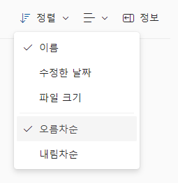
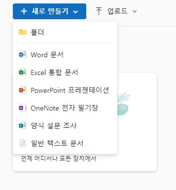

# 🔥 OneDrive Clone-Coding 🔥

## Result ! 😆

 

## OneDrive Clone-Coding을 함으로써 얻게 된 것 😤

 

* 클론 코딩을 시작하면서 웹사이트에 있는 section 들을 어떻게 나누고, 어떻게 진행해 나갈지 볼 수 있는 눈이 생겼습니다.

* 클론 코딩을 해나가면서 이럴 때는 어떤 HTML, CSS 태그들을 써야 될 지 미리 예측할 수 있게 되어, 코딩을 전보다 더 수월하게 할 수 있게 되었습니다.

* flex 기능 (ex: align-items, justify-content) 사용 실력이 향상된 것 같습니다.

* icon font에 대해 알게 되었습니다.

  

## 3주 차 OneDrive Clone-Coding을 함에 있어서 부족했던 점, 미완성한 부분 😥

### 부족했던 점
* 부모, 상속 개념이 완벽하게 잡히지 않아 효율적으로 CSS 등을 사용하는 데에 어려움을 겪었습니다.  
---> 강의 또는 교재로 공부하며 개념을 확실히 잡을 것입니다.

* flex 사용 실력은 전보다는 향상되었지만 아직은 아주 부족한 상태입니다.  
---> flex의 개념도 중요하지만, 많이 써보면서 실력을 키워가야겠다는 생각이 들었습니다.

* 반응형 웹에 관한 공부가 부족하여 반응형 웹을 만들지 못하였습니다.  
---> 추후 강의 등을 통해 따로 새로운 반응형 웹사이트를 만들어 볼 예정입니다.

* 과제를 짧은 시간에 완성하고, 또 다른 과제를 진행하다 보니 자바스크립트 공부가 많이 부족하다고 느꼈습니다.  
---> 자바스크립트 공부를 꾸준히 시간 날 때마다 할 예정입니다.

### 미완성한 부분
 
 

 

자바스크립트를 통해 구현해야 했던 부분이었으나, 시간 부족으로 인해 완성을 하지 못하였습니다. 다음에 완성을 해보도록 하겠습니다.

 
 

     
위와 마찬가지로 자바스크립트를 사용하여 사진과 같이 드론다운 목록 등을 만들었어야 했지만, 시간 부족으로 하지 못하였습니다.

___